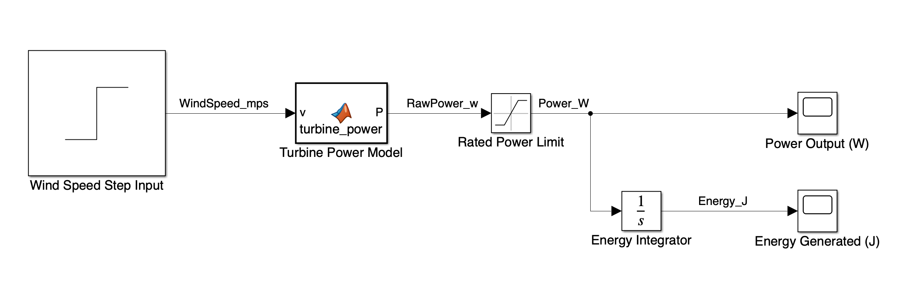
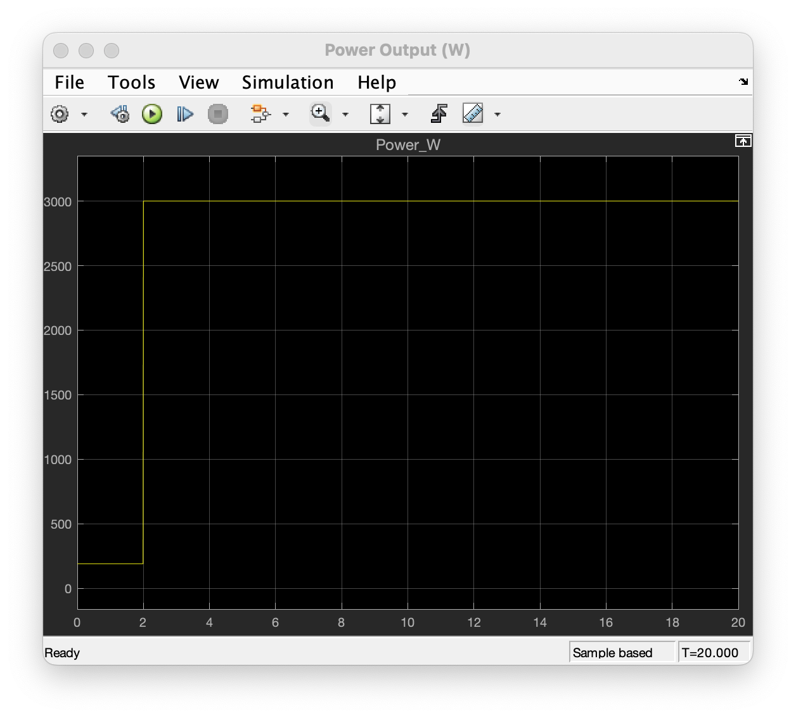
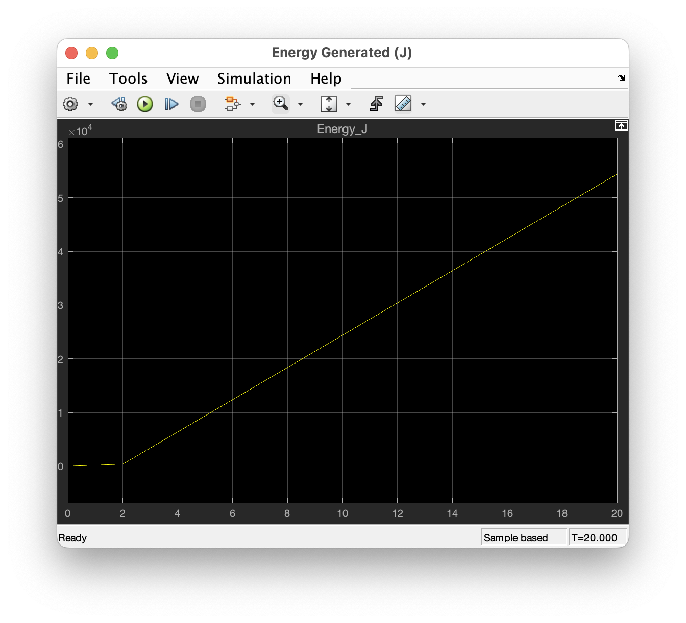

# Wind Turbine Power Simulation — MATLAB / Simulink

This is a simple MATLAB/Simulink physical-system simulation that models wind-speed input, turbine operating limits, power output, and accumulated energy generation.

The project was built as a first Simulink modeling exercise to practice signal flow, physical assumptions, block-diagram modeling, scope visualization, and repeatable simulation setup.

This is an educational toy model using simplified parameters. It is not intended to represent a production wind turbine, certified energy model, or proprietary system.

## Version 1 — Basic Power and Energy Model

The first version models a turbine facing directly into the wind.

Signal flow:

```text
Wind Speed Input
      ↓
Turbine Power Model
      ↓
Rated Power Limit
      ↓
Power Output Scope
      ↓
Energy Integrator
      ↓
Energy Generated Scope
```

The model estimates available turbine power using the simplified wind power equation:

```text
P = 0.5 * rho * A * Cp * v^3
```

Where:

- `P` = turbine power output in watts
- `rho` = air density
- `A` = swept rotor area
- `Cp` = simplified power coefficient
- `v` = wind speed in meters per second

## Features

- Wind speed step input
- Turbine cut-in / cut-out behavior
- Rated power saturation
- Power output scope
- Accumulated energy scope
- MATLAB parameter setup
- Simulink block-diagram model
- Fixed-step simulation workflow

## Simplifying Assumptions

- Turbine rotor faces directly into the wind.
- Air density is constant.
- Power coefficient is constant.
- Generator and drivetrain losses are lumped into `Cp`.
- Wind speed is provided as a simple step input.
- No yaw-angle loss is included yet.
- No blade pitch control or generator dynamics are included yet.

## Screenshots

### Simulink Model Diagram



### Power Output Scope

The power output reaches the rated power limit of 3000 W after the wind-speed step input increases.



### Accumulated Energy Scope

The accumulated energy output is produced by integrating power over simulation time. Since power is measured in watts, integrating over seconds produces energy in joules.



## Files

- `wind_turbine_power_sim.slx` — Simulink model
- `init_wind_turbine_params.m` — model parameter setup
- `run_wind_turbine_sim.m` — script to initialize and run the model
- `images/` — screenshots of the model and scope outputs

## How to Run

Open MATLAB R2022b or newer.

From this folder, run:

```matlab
run_wind_turbine_sim
```

The script loads the model parameters and runs the Simulink model.

## Current Parameters

The starter model uses simplified toy values:

```matlab
rho = 1.225;          % air density, kg/m^3
bladeRadius = 1.5;    % rotor blade radius, meters
A = pi * bladeRadius^2;
Cp = 0.35;            % simplified power coefficient
ratedPower = 3000;    % maximum turbine output, watts
cutIn = 3;            % cut-in wind speed, m/s
cutOut = 25;          % cut-out wind speed, m/s
```

## Future Improvements

Planned extensions:

- Add yaw-angle loss when the turbine is not facing directly into the wind
- Add gusty wind profiles instead of a simple step input
- Convert accumulated energy from joules to watt-hours or kilowatt-hours
- Add dashboard-style indicators for turbine state
- Add fault/status logic for cut-out conditions
- Add additional physical-system emulation demos, such as an electric outboard motor/load model